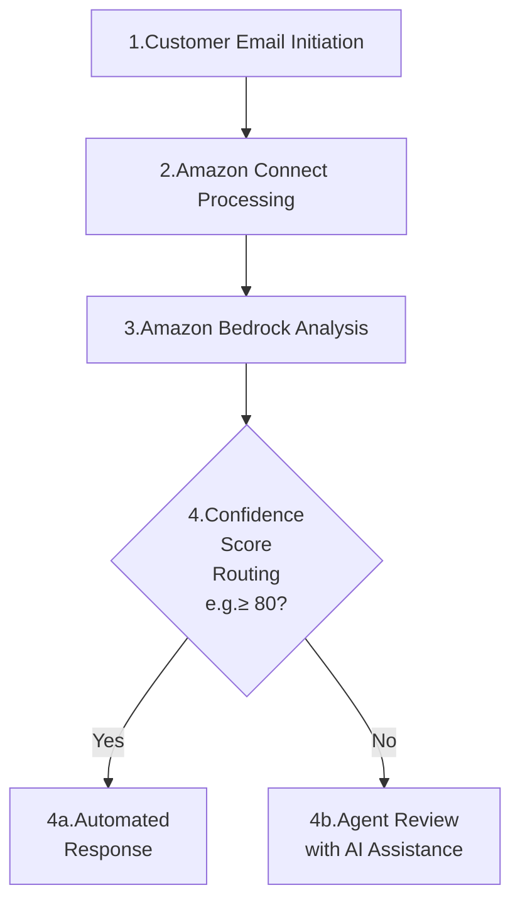
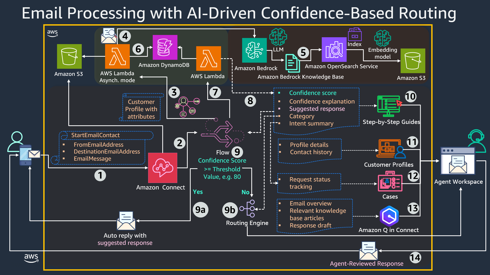
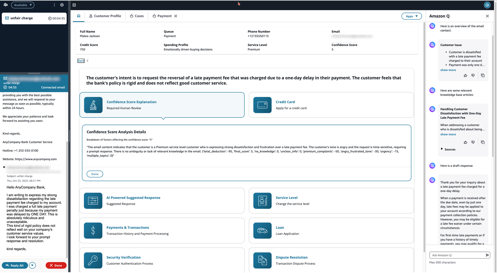
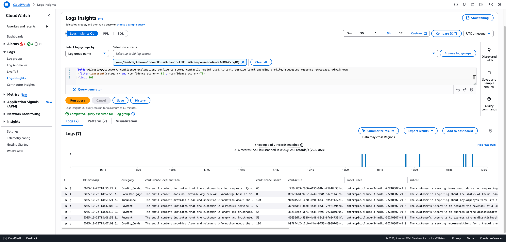
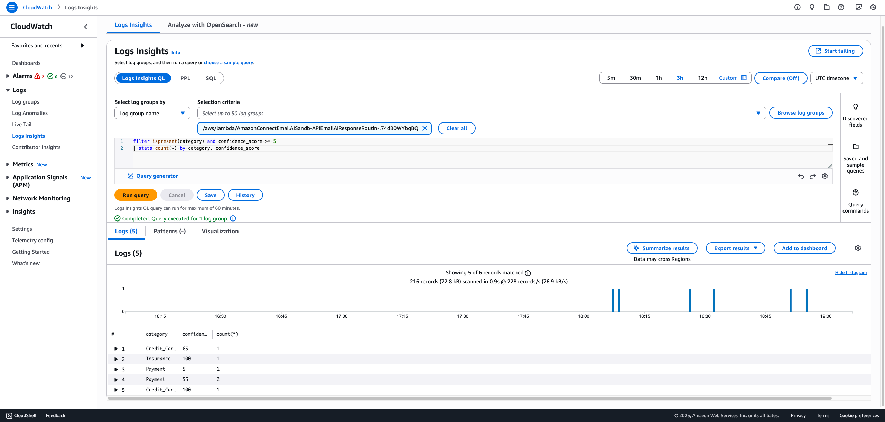

# AI-enhanced Email Response and Routing Solution with Amazon Connect

 Built on Amazon Connect and enhanced by Amazon Bedrock, the solution analyzes incoming customer emails to determine intent, generate personalized responses from knowledge bases, and calculate confidence scores that determine whether to send automated responses or route to agents with AI-assisted insights. For emails requiring agent review, the solution provides contextual customer data, relevant knowledge articles, and AI-generated response suggestions, enabling more efficient and personalized customer service.

## Email Processing Workflow
1. Customer Email Initiation
2. Amazon Connect Processing
   - Performs customer identification
   - Forwards email content to Amazon Bedrock
3. Amazon Bedrock Analysis
   - Analyzes customer intent
   - Performs email categorization
   - Calculates confidence score (0-100) using the [scoring framework](#scoring-framework) described below
   - Generates personalized responses using email content, knowledge articles, customer data from Customer Profiles data ingested from CRM systems or any other 3rd party systems

4. Response Routing Decision based on threshold value (e.g., 80):
   - 4a. If score ≥ threshold: Automated response sent directly to customer
   - 4b. If score < threshold: Email routed to agents with AI-generated insights for review




### Scoring Framework
| Factor                    | Score Impact  | Severity    | Description                                      |
| ------------------------- | ------------- | ----------- | ------------------------------------------------ |
| **Missing Knowledge**     | -100          | 🔴 Critical | Missing relevant KB information available        |
| **Unclear Info**          | -85           | 🔴 High     | Incomplete or ambiguous information              |
| **Premium Complaints**    | -50           | 🟡 Medium   | Premium service level issues                     |
| **Angry/Frustrated Tone** | -30           | 🟡 Medium   | Negative sentiment detected                      |
| **Urgency**               | -15           | 🟢 Low      | Time-sensitive requests requiring quick response |
| **Multiple Topics**       | -10 per topic | 🟢 Low      | Additional topics beyond primary                 |


The evaluation process uses a two-step approach with customizable factors:
1. Content Analysis:
   - Amazon Bedrock's LLM evaluates email content
   - Produces binary outputs (0/1) for each factor by assessing knowledge availability, premium complaints, angry/frustrated tone, etc

2. Score Computation:
   - Dedicated mathematical function applies impact values
   - Ensures precise calculations independent of LLM
   - Maintains final score within 0-100 range

Example Implementation:
- Missing knowledge base match: -100 x 1 points
- Unclear information: -85 x 1 points
- Premium complaints: -50 x 1 points
- Multiple negative factors may accumulate but score floors at 0

All impact factors and their values can be adjusted to match specific business requirements.

## Solution Architecture 
### Overview


1. **Email Ingestion**
   - Incoming customer emails are received by Amazon Connect
   - Email messages are stored in a predefined Amazon S3 bucket

2. **Contact Flow Activation**
   - Amazon Connect triggers the specific ACEmailAI-EmailSuggestedResponseConfidenceScore flow
   - Flow activation is linked to the destination email address

3. **Customer Profile Lookup**
   - Retrieves existing customer profiles using sender's email address
   - Extracts critical attributes including Credit Score, Spending Profile, Service Level and additional parameters
   - Provides contextual information for AI response generation

4. **AI Processing and Confidence Scoring**

   Main AWS Lambda function processes email asynchronously (handles 8+ second processing times)
   - Invokes Amazon Bedrock API to perform:
     * Detailed customer intent analysis
     * Email categorization (Credit_Cards, Insurance, Loan_Mortgage, Online_Banking, Investment, Payment, etc.)
     * Confidence score calculation (0-100) using defined scoring framework
   - Uses Claude 3.5 Haiku with automatic fallback to Claude 3 Haiku for unsupported regions. You can use other LLM available through Amazon Bedrock API, though code modifications may be required.

5. **Knowledge Base Integration**
   - AWS Lambda function performs:
     * Amazon Bedrock retrieval of contextually relevant responses
     * Vector-based similarity search
     * Processing via Titan Text Embeddings v2
     * Indexing in OpenSearch Serverless
   - LLM generates personalized responses combining:
     * Email content
     * Knowledge base information
     * Customer data

6. **Result Storage**
   - All processing results saved to an Amazon DynamoDB table
   - Uses contact ID as primary key for efficient retrieval

7. **Polling Mechanism**
   - Secondary AWS Lambda function polls results from the Amazon DynamoDB table
   - Every 3 seconds for up to 3 iterations
   - Includes initial 12-second wait period

8. **Contact Flow Output**
   - Processing results retrieved and saved as contact flow attributes
   - Used for subsequent routing decisions

9. **Routing Decision**
   
   Based on confidence threshold (e.g., 80):
   - 9a. High Confidence (≥80): Generated response automatically sent to customer
   - 9b. Low Confidence (<80): Email routed to agent queue for manual review

10. **Step-by-Step Guides**
    
    Display comprehensive information to agents:
    - Customer attributes 
    - Category information
    - Intent summary
    - Confidence score and detailed explanation
    - AI-generated suggested response

11. **Customer Profiles**
    
    Provide agents
    - Customer profile information access
    - Full contact history visibility

12. **Case Management**
    - Adds intent summaries to new/updated cases
    - Maintains contact history organized by category

13. **AI-enhanced Assistant**
    
    Amazon Q in Connect enhances agent efficiency through:
      * Email overviews
      * Relevant knowledge base article surfacing
      * Response draft creation

14. **Agent Response**
    - Enables agents to utilize AI-suggested responses as drafts
    - Facilitates faster and more efficient customer communication
    - Maintains human oversight for quality control

### Key Components
1. [**Amazon Connect**](https://docs.aws.amazon.com/connect/latest/adminguide/regions.html) delivers a comprehensive contact center solution through several integrated components:

   - **Contact Center Core** orchestrates the email routing, queue assignments, and contact flows, managing both automated and agent-assisted responses.

   - **Customer Profiles** provides agents with a unified view of customer information, consolidating contact history and preferences to enable context-aware interactions.

   - **Step-by-Step Guides** delivers structured guidance for agents by combining AI insights with procedural workflows, ensuring standardized issue handling.

   - **Cases** enables systematic tracking of customer issues, managing the complete lifecycle from creation to resolution while maintaining categorized interaction history.

   - **Amazon Q in Connect** enhances agent productivity through AI-enhanced assistance, providing email summaries, surfacing relevant knowledge, and supporting response drafting.

2. [**Amazon Bedrock with Knowledge Bases**](https://docs.aws.amazon.com/bedrock/latest/userguide/knowledge-base-supported.html) powers the solution's intelligence layer using Claude 3.5 Haiku (with Claude 3 Haiku as regional backup) to analyze customer intent, categorize content, and generate contextual responses based on the analyzed content and available knowledge.

3. [**OpenSearch Serverless**](https://docs.aws.amazon.com/general/latest/gr/opensearch-service.html) transforms the stored knowledge articles into searchable vector embeddings, enabling intelligent semantic search capabilities. Through vector-based similarity matching, it helps surface the most relevant information from the knowledge base to address customer inquiries. Its integration with Bedrock Knowledge Bases ensures that responses are enriched with precise, contextual information.

4. **Amazon S3** works as the central storage hub for incoming customer emails and houses a comprehensive collection of knowledge base articles. These articles are later ingested into OpenSearch Serverless, enabling sophisticated search capabilities across the organization's knowledge base.

5. **AWS Lambda Functions** orchestrates the email processing through a dual-function approach. The primary function manages AI interactions and scoring, while a secondary function handles asynchronous operations, ensuring smooth processing of larger workloads and timely result retrieval.

6. **Amazon DynamoDB** serves as the operational database, maintaining real-time processing results and contact metadata. This enables efficient asynchronous operations and quick data retrieval for both automated and agent-assisted responses.


### Key Features

1. **Intelligent Processing**
Combines automated content analysis with smart confidence scoring to determine optimal handling paths for each customer interaction.

2. **Enhanced Response System**
Generates contextually aware responses by leveraging knowledge bases, customer history, and AI-driven insights.

3. **Smart Routing**
Directs emails based on content category, confidence scores, and agent expertise, ensuring optimal handling of each customer inquiry.

4. **Risk and Quality Management**
Employs multi-factor assessment to ensure response quality and compliance, with automatic routing to human agents when needed.

5. **Technical Reliability**
Ensures consistent service through asynchronous processing, regional failover capabilities, and robust error handling mechanisms.

6. **Seamless Integration**
Connects with existing systems and data sources while maintaining flexibility for custom workflows and future expansions.

## Project Structure

This project follows the [AWS CDK recommended project structure](https://aws.amazon.com/blogs/developer/recommended-aws-cdk-project-structure-for-python-applications/) for Python applications, organizing code into logical units (constructs) for better maintainability and reusability.

```
├── backend/                                    # Backend Component (Logical Units)
│   ├── api/                                   # API Logical Unit
│   │   ├── runtime/                          # AWS Lambda Function Code
│   │   │   ├── lambda_function.py            # Main email processing
│   │   │   ├── query_tempo_storage.py        # Async result polling
│   │   │   └── requirements.txt              # AWS Lambda dependencies
│   │   └── infrastructure.py                 # API infrastructure (AWS Lambda functions)
│   │
│   ├── database/                             # Database Logical Unit
│   │   └── infrastructure.py                 # Amazon DynamoDB table
│   │
│   ├── storage/                              # Storage Logical Unit
│   │   └── infrastructure.py                 # Amazon S3 bucket for knowledge articles
│   │
│   ├── knowledge/                            # Knowledge Base Logical Unit
│   │   └── infrastructure.py                 # Amazon Bedrock Knowledge Base
│   │
│   ├── connect/                              # Amazon Connect Integration Logical Unit
│   │   └── infrastructure.py                 # Amazon Connect integration
│   │
│   └── component.py                          # Main backend component (Stack)
│
│   ├── opensearch/                          # OpenSearch Stack
│   │   ├── __init__.py                      # Package initialization
│   │   └── component.py                     # OpenSearch Serverless resources
│   │
│
├── contact-flows/                            # Amazon Connect Flows
│   ├── Email-SBS.json                       # Step-by-step guidance (deployed as ACEmailAI-Email-SBS)
│   └── EmailSuggestedResponseConfidenceScore.json # Main email flow (deployed as ACEmailAI-EmailSuggestedResponseConfidenceScore)
│
├── knowledge-articles/                       # AI Knowledge Base Content
│   ├── auto/          # Auto loan articles
│   ├── credit/        # Credit card articles  
│   ├── insurance/     # Insurance articles
│   ├── investment/    # Investment articles
│   └── payment/       # Payment articles
│
├── solution-diagrams/                        # Architecture diagrams
│
├── app.py              # CDK app entry point
├── constants.py        # Application constants
├── cdk.json            # CDK configuration
├── .env                # Environment variables
├── requirements.txt    # Python dependencies
├── customerprofiles.csv # Sample customer data
├── cleanup.sh          # Resource cleanup script (Linux/macOS)
├── cleanup.ps1         # Resource cleanup script (Windows)
└── README.md           # Main documentation
```

### Logical Units

The backend is organized into logical units (constructs) that can be independently maintained and potentially reused:

- **API**: AWS Lambda functions for email processing and querying
- **Database**: Amazon DynamoDB table for temporary storage
- **Storage**: Amazon S3 bucket for knowledge articles
- **Knowledge**: Amazon Bedrock Knowledge Base and data sources
- **Connect**: Amazon Connect integration components
- **OpenSearch**: OpenSearch Serverless collection for vector embeddings and semantic search

Each logical unit contains its infrastructure definition and any associated runtime code, making it a self-contained unit that can be easily modified or refactored.


## Deployment

Before deploying the stacks in your chosen region, ensure that all [**Key Components**](#key-components) are available in that region. The deployment has been successfully tested in us-east-1 (North Virginia) and eu-central-1 (Frankfurt).

### 1. Environment Setup
```bash
python -m venv .venv
.venv\Scripts\activate  # Windows
source .venv/bin/activate   # macOS/Linux
pip install -r requirements.txt
```

### 2. Prerequisites

#### 2.1. Deployment Environment
- [AWS account](https://docs.aws.amazon.com/accounts/latest/reference/manage-acct-creating.html) and [AWS security credentials](https://docs.aws.amazon.com/IAM/latest/UserGuide/security-creds.html)
- [AWS CLI installed and configured on your local machine](https://docs.aws.amazon.com/cli/latest/userguide/cli-chap-getting-started.html)
- [AWS CDK installed on your local machine](https://docs.aws.amazon.com/cdk/v2/guide/getting-started.html)
- [Python 3.13 or later](https://www.python.org/downloads/)

#### 2.2. Enable Amazon Bedrock Models
Enable Amazon Bedrock models "Claude 3.5 Haiku" (and "Claude 3 Haiku" as fallback based on regional availability) and the "Titan Text Embeddings v2" in your AWS account:

1. Navigate to Amazon Bedrock using the AWS Console search bar
2. In Amazon Bedrock, click the hamburger menu (three stacked lines) on the left side navigation in the Amazon Bedrock Console
3. Scroll to the bottom of the left side navigation in the Amazon Bedrock Console to "Bedrock configurations"
4. Click "Model access" under "Bedrock configurations"
5. Under the Anthropic section, make sure that the "Claude 3.5 Haiku", "Claude 3 Haiku" (fallback), and "Titan Text Embeddings v2" rows show the "Access status" of "✅ Access granted"
6. If it does not show "✅ Access granted", click the orange button at the top of the page that says "Modify model access" to toggle the table to allow selections of models
7. Check the box in the "Claude 3.5 Haiku" row, "Claude 3 Haiku" row (fallback), and the "Titan Text Embeddings v2" row
8. Scroll to the bottom of the page and click "Next"
9. This will take you to the "Review and submit" page where you should see a status of "Access granted"
10. Click "Submit" to enable the Amazon Bedrock model for your account

#### 2.3. Amazon Connect Resources
Before deployment, ensure you have the following AWS resources enabled  in your Amazon Connect instance:

- [**Email capablities**](https://www.youtube.com/watch?v=MXuJTHR_-zE)
- [**Customer Profiles**](https://docs.aws.amazon.com/connect/latest/adminguide/enable-customer-profiles.html)
- [**Cases**](https://docs.aws.amazon.com/connect/latest/adminguide/enable-cases.html) and [**case template**](https://docs.aws.amazon.com/connect/latest/adminguide/case-templates.html)
- [**Amazon Q in Connect with Amazon S3 integration**](https://docs.aws.amazon.com/connect/latest/adminguide/enable-q.html)


### 3. Configuration
#### 3.1 Update the `.env` file in the project root:

- Enter your actual AWS resource values in place of the placeholders
- Save the file before proceeding with deployment

#### 3.2 Update the `customerprofiles.csv` file in the project root:

- Update the `EmailAddress` field with real email addresses where you can send and receive emails
- Save the file before proceeding with deployment

### 4. Deploy OpenSearch
```bash
# Bootstrap and deploy OpenSearch stack first
cdk bootstrap
cdk deploy OpenSearchStack --require-approval never
```

**Note:** The `--require-approval never` flag approves IAM policy changes and security group modifications without manual confirmation prompts, enabling automated deployments in CI/CD pipelines. You can remove this option if you prefer to manually review and approve changes during deployment.

### 5. Create OpenSearch Index Manually
#### 5.1 After OpenSearch stack deployment, create the index 
##### Option 1: **Using AWS CLI prepared in the scripts:**

- **Linux/macOS:**
Run the provided bash script:
```bash
chmod +x create-opensearch-index.sh
./create-opensearch-index.sh
```

- **Windows PowerShell:**
Run the provided PowerShell script:
```powershell
powershell -ExecutionPolicy Bypass -File create-opensearch-index.ps1
```

**Important Note:** Not all features of Amazon OpenSearch Serverless are available in every AWS region. If you receive the error: "An error occurred (AccessDeniedException) when calling the CreateIndex operation: API is not supported", follow the manual index creation steps using AWS console in the option 2.

##### Option 2: **Using AWS console:**

1. **Navigate to OpenSearch Console:**
   - Go to AWS console → OpenSearch Service → Serverless collections
   - Click on `kb-vector-collection`

2. **Create Index:**
   - Click "Indexes" tab
   - Click "Create index"
   - Click "JSON"
   - Index name: `kb-email-ai-acemailaisandbox-index`
   - Index mapping: 
   
      Copy and paste the following JSON into the mapping field:
      ```json
      {
         "settings": {
            "index.knn": true
         },
         "mappings": {
            "properties": {
               "bedrock-knowledge-base-default-vector": {
               "type": "knn_vector",
               "dimension": 1024,
               "method": {
                  "name": "hnsw",
                  "engine": "faiss"
               }
               },
               "AMAZON_BEDROCK_TEXT_CHUNK": {"type": "text"},
               "AMAZON_BEDROCK_METADATA": {"type": "text"}
            }
         }
      }
      ```
     
   - Click "Create index" to complete the process
   - If you have already created an index using the manual steps described above, you can skip the steps described in the section 5.2.

#### 5.2. Verify OpenSearch Collection and Index
After creating the index, verify the collection is active and index exists:

```bash
# Check collection status.
aws opensearchserverless batch-get-collection --names kb-vector-collection --region "<value of AWS_REGION in the file .env>"

# Verify if the index was created successfully by replacing $COLLECTION_ID with the value of collection ID ["collectionDetails"](0)["id"] obtained from the previous command.
aws opensearchserverless get-index --id "<collection ID>" --index-name "kb-email-ai-acemailaisandbox-index" --region "<value of AWS_REGION in the file .env>"
```

**Expected Results:**
- Collection status should be `ACTIVE`
- Index `kb-email-ai-acemailaisandbox-index` should return index details without errors

### 6. Deploy Main Stack
```bash
# Deploy main stack after index creation
cdk deploy ACEmailAISandbox --require-approval never
```

**Note:** You can remove the `--require-approval never` option if you prefer to manually review and approve changes during deployment.

### 7. Sync Knowledge Base Data (Manual Step)
After deployment, sync your knowledge articles with the Bedrock Knowledge Base:

1. **Navigate to Bedrock Console**
   - Go to AWS Console → Bedrock → Knowledge bases
   - Select `EmailAIKnowledgeBase`

2. **Sync Data Source**
   - Click on the data source
   - Click "Sync" to ingest knowledge articles
   - Monitor sync status until complete

For detailed instructions, see: [Sync your data with your Amazon Bedrock knowledge base](https://docs.aws.amazon.com/bedrock/latest/userguide/kb-data-source-sync-ingest.html)

### 8. Associate Contact Flow with Email Address (Manual Step)
After all stacks are deployed successfully, manually associate the contact flow with your email address:

1. Navigate to Amazon Connect Console
2. Go to Channels → Email addresses
3. Select your email address specified in your `AMAZON_CONNECT_EMAIL_ADDRESS` environment variable in the file .env.
4. Set "Flow" to "ACEmailAI-EmailSuggestedResponseConfidenceScore"
   
   **Note**: The CDK deployment automatically prefixes contact flow names with "ACEmailAI-" to clearly identify resources belonging to this application.

5. Click "Save"

### 9. Enable Amazon Q in Connect Integration for Email (Manual Step)

This step is to enhance your email workflow with generative AI-enhanced conversation overviews, suggested actions, and intelligent responses using Amazon Q in Connect.

1. **Upload Knowledge Articles to an Amazon S3 Bucket integrated with Amazon Q in Connect**
   - Upload all subfolders and files from the [knowledge-articles](./knowledge-articles) directory to the Amazon S3 bucket

2. **Configure Contact Flow Integration**
   - Navigate to Amazon Connect Console
   - Go to Routing → Flows
   - Locate and open the flow named "ACEmailAI-EmailSuggestedResponseConfidenceScore"
   - Find the "Amazon Q in Connect" block within the flow
   - Check and associate the right ARN of your Amazon Q in Connect domain with this block
   - Save and publish the flow

## Test Email Samples

After successful deployment, test the system with these sample emails:

### Sample 1: Premium Complaint (Low Confidence - Agent Review Required)**
This email contains premium service complaints, angry tone and urgency, resulting in a low confidence score that requires agent review:

```
Subject: Unfair Late Payment Fee Charged

Hello AnyCompany Bank,

I am writing to express my dissatisfaction regarding the late payment fee charged to my account. I was charged a full late payment penalty just because my payment was delayed by ONE DAY. This is absolutely ridiculous and unacceptable.
This kind of rigid policy does not reflect well on your company's customer service values.
I look forward to your prompt response and resolution.

Regards,
```

**Expected Result**: Routed to agent for manual review due to premium complaints (-50), angry/frustrated tone (-30) and urgency (-15). The confidence score is 5.




### Sample 2: General Inquiry (High Confidence - Automated Response)**
This general query receives an automated response with high confidence score 100:

```
Subject: Travel Credit Card Recommendations

Hello AnyCompany Bank,

As a six-year customer, I'm seeking a travel credit card that converts daily spending into travel rewards. I'd appreciate your card recommendations that include flight and hotel rewards, plus airport lounge access.
Please share details about annual fees and current sign-up bonuses.
```

**Expected Result**: Suggested response is sent automatically because there is a knowledge article 


## Analytics and Data Insights by Using Amazon CloudWatch Logs Insights

Monitor AWS Lambda function outputs using Amazon CloudWatch Insights with these queries:

**Log Group**: `/aws/lambda/ACEmailAI-EmailAIResponseRouting`

### Detailed Email Processing Query

```sql
fields @timestamp,category, confidence_explanation, confidence_score, contactId, model_used, intent, service_level,spending_profile, suggested_response, @message, @logStream
| filter ispresent(category) and (confidence_score >= 80 or confidence_score < 70)
| limit 100
```

This query extracts detailed email processing information for high-confidence automated responses (>=80) and very low-confidence cases (<70). It displays all key fields including customer details, AI analysis results, and Claude model usage tracking, limited to 10,000 most recent records.



**Detailed Query Results Include:**
- Complete email processing records with customer context
- High-confidence automated responses and problematic low-confidence cases
- AI-generated intent summaries and confidence explanations
- Customer service levels and spending profiles for personalized responses
- Model tracking whether Claude 3.5 Haiku or Claude 3 Haiku was used based on regional availability

### Aggregated Statistics Query

```sql
filter ispresent(category) and confidence_score >= 5
| stats count(*) by category, confidence_score
```

This query filters for processed emails with confidence scores of 5 or higher and groups results by category and confidence score to show distribution patterns.



**Query Results Include:**
- Email processing statistics grouped by category and confidence score
- Distribution of confidence scores across different email categories  
- Count of processed emails per category-confidence combination
- Performance metrics showing system effectiveness by email type

## Cleanup

Before destroying the stacks, complete these cleanup steps:

### 1. Disassociate Contact Flow
1. Navigate to Amazon Connect Console
2. Go to Channels → Email addresses
3. Select your email address specified in your `AMAZON_CONNECT_EMAIL_ADDRESS` environment variable in the file .env.
4. Set "Flow" to any other flow
5. Click "Save"

### 2. Clean Up Resources Not Removable by CDK Destroy
Some AWS resources are not automatically removed by `cdk destroy --all` and require manual cleanup. Use the provided cleanup scripts to remove these resources:

- **Linux/macOS:**
```bash
chmod +x cleanup.sh
./cleanup.sh
```

- **Windows PowerShell:**
```powershell
.\cleanup.ps1
```

These scripts will clean up:
- **Lambda Log Groups**: Removes conflicting CloudWatch log groups that may prevent redeployment
- **Customer Profiles**: Deletes test customer profiles created during deployment using account numbers from `customerprofiles.csv`

The cleanup scripts automatically read configuration from your `.env` file and provide status updates for each operation. Run these scripts if you encounter deployment conflicts or before redeploying the solution.

### 3. Destroy AWS Resources
Remove all deployed resources:
```bash
cdk destroy --all
```

## ⚠️ Important: This project is a sample implementation and is not eligible for production usage without additional security features and compliance controls

Prepare this solution for production deployment, implementing the following responsible AI and security measures is strongly recommended. Note that this list is not exhaustive, and additional safeguards may be necessary depending on your organization's requirements.

- [Monitor model invocation using Amazon CloudWatch Logs and Amazon S3](https://docs.aws.amazon.com/bedrock/latest/userguide/model-invocation-logging.html)
- [Detect and filter harmful content by using Amazon Bedrock Guardrails](https://docs.aws.amazon.com/bedrock/latest/userguide/guardrails.html)

   - **Content filters for harmful categories**: Baseline protections for content filtering must be enabled as part of every deliverable
   - **Content filters for prompt injections**: Baseline protections for content filtering must be enabled as part of every deliverable  
   - **Denied topics configuration**: Understand the intended use cases from the deliverable and be able to curate a list of denied topics to improve the responsible use of the solution
   - **Profanity filter**: Baseline protections for unsafe LLM output must be configured for every deliverable
   - **PII filters**: PII identification and redaction must be enabled for every deliverable
   - **Guardrail intervention alerting**: Guardrail intervention metrics are tracked by default in Amazon CloudWatch. When using guardrails, we must either set up alerting or reporting using Amazon CloudWatch Alarms or Dashboards for anytime a guardrail intervenes in a user's request or response

## Disclaimer

This prompt engineering template is provided to you as AWS Content under the AWS Customer Agreement, or the relevant written agreement between you and AWS (whichever applies). You should not use this prompt engineering template in your production accounts, or on production, or other critical data. You are responsible for testing, securing, and optimizing the prompt engineering as appropriate for production grade use based on your specific quality control practices and standards. AWS may reuse this prompt engineering template in future engagements, but we will not share your confidential data nor your intellectual property with other customers.